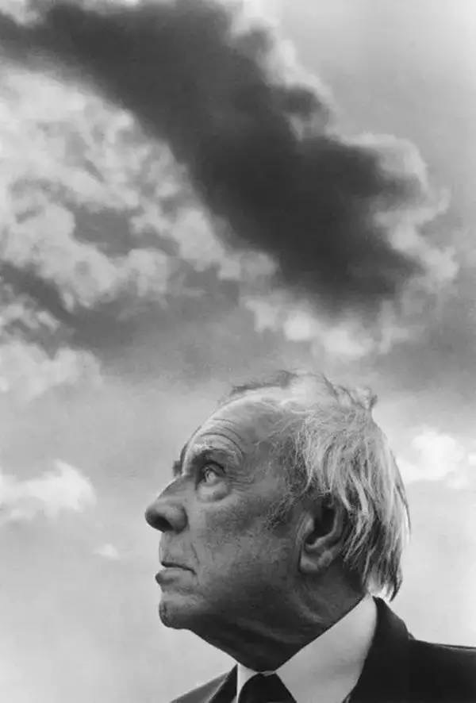
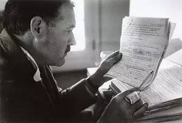
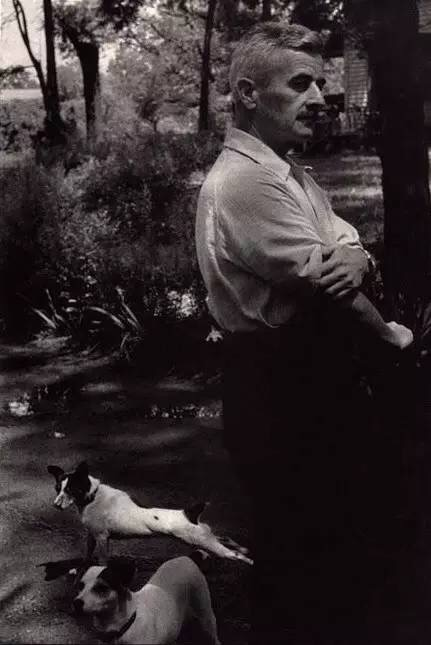
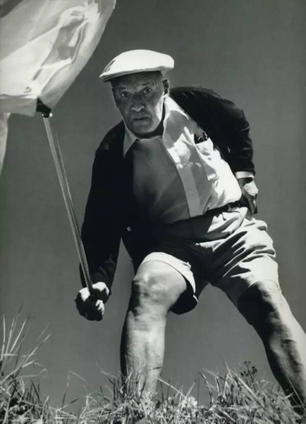
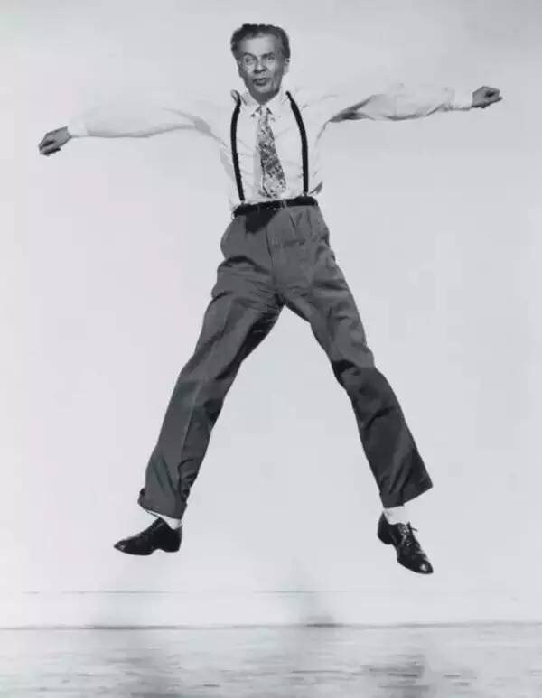
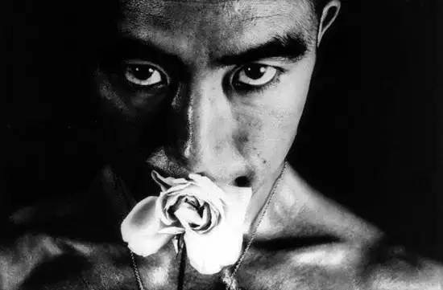

盲眼的博尔赫斯面向太阳站在巴勒莫一家海边旅馆的阳台上，试图通过空气中的味道猜想天空的颜色。“是东方的蓝玉色，但丁在《神曲》的《炼狱篇》第一章写到的那种”，他对身旁的摄影师费迪南多·希安纳说。费迪南多·希安纳就在那时按下了快门……

这是博尔赫斯去世前两年的留影，也是他最常被提起的形象。  
  
以下这些作家的照片，也都出自摄影名家之手。不知道是否能印证你阅读他们文字时的想象？

欧内斯特·米勒尔·海明威  
Ernest Miller Hemingway  
代表作：《老人与海》《太阳照常升起》  
拍摄时间：1940年  
   
*摄影：罗伯特·卡帕*  
> 每个人都不是一座孤岛，一个人必须是这世界上最坚固的岛屿，然后才能成为大陆的一部分。  
> ——《丧钟为谁而鸣》

威廉·福克纳  
William Faulkner  
代表作：《喧哗与骚动》《我弥留之际》  
拍摄时间：1947年  
     
*摄影：亨利·卡蒂埃-布列松*  
>“诗人的声音不必仅仅是人类的记录，它可以作为一个支柱，一根栋梁，帮助人类度过难关，蓬勃发展。”  
>——威廉·福克纳

弗拉迪米尔·纳博科夫  
Vladimir Nabokov  
代表作：《洛丽塔》《普宁》《微暗的火》  
拍摄时间： 1966年  
 
*摄影：菲利普·哈尔斯曼*
>她可以褪色，可以枯萎，怎样都可以，但只要我看她一眼，万般柔情便涌上心头。  
>——《洛丽塔》

阿道司·赫胥黎  
Aldous Huxley  
代表作《美丽新世界》  
拍摄时间： 1958年  
  
*摄影：菲利普·哈尔斯曼*  
>或许这个世界是另一个星球的地狱。  
>——阿道司·赫胥黎

三岛由纪夫  
Yukio Mishima  
1970年，细江英公准备出版收录这张照片的专题摄影集时，三岛由纪夫自杀身亡。  
拍摄时间：1961年  
  
*摄影：细江英公*  
> 也许是天生懦弱的关系,我对所有的喜悦都掺杂着不祥的预感。  
> ——三岛由纪夫